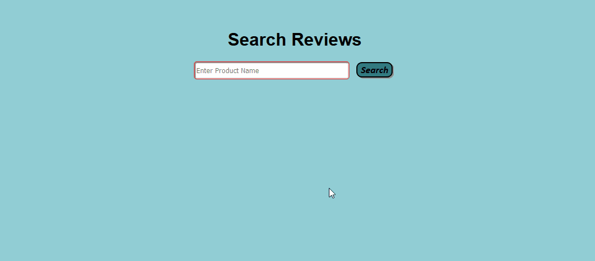

# FlipKart-Reviews-Web-Scrapper-Project

This is a Flask application to web scrap reviews of products from FlipKart

This Project uses -
  - MongoDB as a database to store the reviews
  - BeautifulSoup for Web Parser

A glimpse of the web app is shown below

